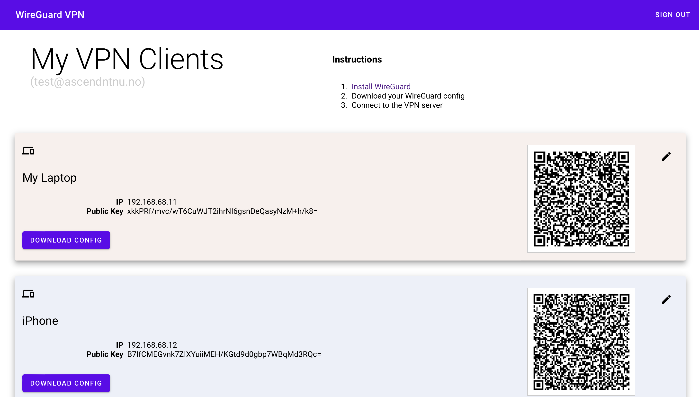

# WG UI

[](https://github.com/EmbarkStudios)
[](CODE_OF_CONDUCT.md)

A basic, self-contained management service for [WireGuard](https://wireguard.com) with a self-serve web UI.  
Current stable release: [v1.3.0](https://github.com/EmbarkStudios/wg-ui/releases/tag/v1.3.0)  

## Features

 * Self-serve and web based
 * QR-Code for convenient mobile client configuration
 * Optional multi-user support behind an authenticating proxy
 * Zero external dependencies - just a single binary using the wireguard kernel module
 * Binary and container deployment
 * This Ascend version also has a sign out button :D
 * Instead of showing the Google ID, your company email is shown



### Configuration

You can configure wg-ui using commandline flags or environment variables.
To see all available flags run:

```
./wireguard-ui -h
```

## Install without Docker

You need to have WireGuard installed on the machine running `wg-ui`.

Unless you use the userspace version with docker you're required to have WireGuard installed on your host machine.  

Ubuntu installation guide:
[Ubuntu 20.04 LTS](https://www.cyberciti.biz/faq/ubuntu-20-04-set-up-wireguard-vpn-server/)  

### Go installation 
Install latest version of Go from (https://golang.org/dl/)

```
sudo tar -C /usr/local -xzf go$VERSION.$OS-$ARCH.tar.gz
```

### Setup environment
Bash: ~/.bash_profile  
ZSH: ~/.zshrc

```
export PATH=$PATH:/usr/local/go/bin:$HOME/go/bin
export GOPATH=$HOME/go
```

### Fetch wg-ui

```
git clone https://github.com/EmbarkStudios/wg-ui.git && cd wg-ui
```

### Build binary with ui

```
make build
```


```
make build-armv6
```

```
make build-armv7
```

### Build step by step

```
make ui
make build
```

## Developing

### Start frontend server
```
npm install --prefix=ui
npm run --prefix=ui dev
```

### Use frontend server when running the server

```
make build
sudo ./bin/wireguard-ui --log-level=debug --dev-ui-server http://localhost:5000
```

## Setting up Nginx as reverse proxy, and oauth2-proxy as authenticator with Google as provider

Note: This example is running Wireguard-ui on port 8080.

Edit the `/etc/nginx/sites-enables/default` or create a new config with these settings. Note: the SSL certificate and key, are both located in `/etc/nginx/ssl`:
```
server {
  listen [::]:443 ssl;
  listen 443 ssl;
  server_name server-name;
  ssl on;
  ssl_certificate ssl/ssl_certificate.cer
  ssl_certificate_key ssl/ssl_key.key;

  location / {
     proxy_pass http://127.0.0.1:4180;
     proxy_set_header Host $host;
     proxy_set_header X-Real-IP $remote_addr;
     proxy_set_header X-Scheme $scheme;
     proxy_connect_timeout 1;
     proxy_send_timeout 30;
     proxy_read_timeout 30;
  }
}

server {
  listen 80;
  listen [::]:80;
  server_name server-name;

  location / {
    if ($host = server-name) {
      return 301 https://$host$request_uri;
    }
  }
}
```
To set up [oauth2-proxy](https://github.com/oauth2-proxy/oauth2-proxy), you have to install the latest version from their GitHub.
Then follow this [guide](https://oauth2-proxy.github.io/oauth2-proxy/docs/configuration/oauth_provider#google-auth-provider) to get your client ID and secret from Google.
After you have installed it, create a config (for example `/etc/oauth2-proxy.cfg`):

```
prompt = "select_account"
provider = "google"


redirect_url = "https://cp.example.com/oauth2/callback"
reverse_proxy = true

email_domains = [
      "yourcompany.com"
]

client_id = "google-client-id"
client_secret = "google-client-secret"

pass_user_headers = true


cookie_name = "_oauth2_proxy"
cookie_secret = "cookie-seed"
cookie_expire = "1h"
upstreams = "http://127.0.0.1:8080/"
```
I recommend checking out the official oauth2-proxy [documentation](https://oauth2-proxy.github.io/oauth2-proxy/docs/configuration/overview) for more settings and configs. It also shows how you can generate your cookie seed. 

To run oauth2-proxy, just run `oauth2-proxy --config=/etc/oauth2-proxy.cfg`.

## Contributing

We welcome community contributions to this project.

Please read our [Contributor Guide](CONTRIBUTING.md) for more information on how to get started.

## License
Licensed under either of

* Apache License, Version 2.0, ([LICENSE-APACHE](LICENSE-APACHE) or http://www.apache.org/licenses/LICENSE-2.0)
* MIT license ([LICENSE-MIT](LICENSE-MIT) or http://opensource.org/licenses/MIT)

at your option.
